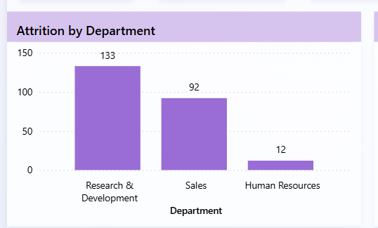

# Employee Attrition & Workforce Analytics Dashboard

This project analyzes employee attrition patterns using a workforce dataset of 1,470 employees.  
The dashboard was built in Power BI to understand attrition trends across departments, age groups, education fields, and tenure.

## Project Overview

The goal of this analysis is to identify workforce segments with higher attrition and highlight patterns that could help HR teams improve employee retention.

Dataset size: 1,470 employees

## Key Metrics

* Total Employees: 1,470  
* Active Employees: 1,233  
* Attrition Count: 237  
* Attrition Rate: 16%

## Dashboard Preview

## Key Insights

* Employees under 30 show the highest attrition rate (around 28%)
* Research & Development department has the highest attrition count
* Early-career employees contribute significantly to overall attrition

## Attrition Breakdown

Further analysis shows:

* Attrition rate differences across age groups
* Attrition distribution by education field
* Higher exits among employees with shorter tenure

## Tools Used

* Power BI  
* Data Visualization  
* DAX Measures  
* Data Cleaning  

## Dataset

HR workforce dataset containing employee demographics, department, tenure, education field, and attrition status.

## Author

Amulya R  
Aspiring Data Analyst  
Skills: SQL | Excel | Power BI | Python
