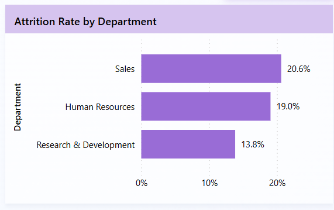
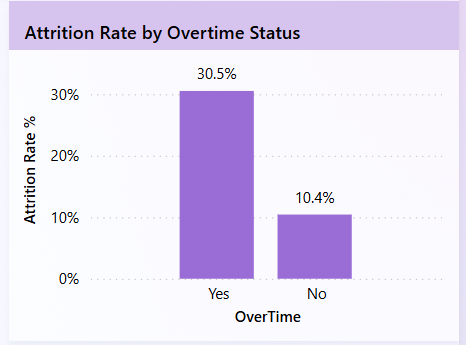
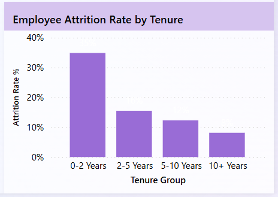

# Employee Attrition & Workforce Analytics Dashboard

This project analyzes employee attrition trends using workforce data to uncover insights related to employee retention, overtime impact, department-level attrition, tenure trends, and workforce demographics.

Using Power BI, an interactive HR analytics dashboard was developed to help identify high-risk employee segments, workforce patterns, and factors contributing to employee attrition.

## Business Problem

Employee attrition is a major challenge for organizations as high workforce turnover can increase recruitment costs, reduce productivity, and impact workforce stability.

This analysis helps identify:
- Which departments experience higher attrition
- Which employee groups are at higher risk of leaving
- Whether overtime contributes to employee turnover
- How employee tenure impacts retention
- Which workforce segments require stronger retention strategies

This analysis aims to answer important business questions such as:

- Which departments have the highest attrition rates?
- Which employee groups are more likely to leave the organization?
- Does overtime significantly impact employee attrition?
- How does employee tenure affect retention?
- Which workforce segments require stronger retention planning?
- Which job roles receive the highest average monthly income?

## Project Objective

The objective of this project is to analyze workforce attrition trends and uncover HR insights using Power BI visualizations to support employee retention strategies and workforce decision-making.

## Key Metrics

- Total Employees: 1,470
- Active Employees: 1,233
- Attrition Count: 237
- Attrition Rate: 16.1%

## Dashboard Preview

The interactive Power BI dashboard provides a consolidated view of workforce attrition trends, employee demographics, overtime impact, tenure analysis, and salary distribution across departments and job roles.

## Dashboard Features

- Interactive department-level filtering
- Dynamic KPI cards for workforce tracking
- Attrition rate analysis across departments
- Overtime impact visualization
- Age-group and tenure-based attrition analysis
- Salary analysis across top job roles
- Workforce retention insights

## Key Visual Insights

### Attrition Rate by Department

This visualization compares attrition rates across departments and helps identify workforce segments experiencing higher employee turnover.

### Attrition Rate by Overtime Status

This chart highlights the relationship between overtime and employee attrition, showing significantly higher attrition rates among employees working overtime.

### Employee Attrition Rate by Tenure

This visualization shows how attrition changes based on employee tenure, helping identify early-stage workforce retention challenges.

## Key Insights

- Employees working overtime showed significantly higher attrition rates compared to employees not working overtime.

- Employees under 30 years experienced the highest attrition trends, indicating higher turnover among early-career employees.

- Sales department showed the highest attrition rate among departments analyzed.

- Attrition decreased as employee tenure increased, suggesting stronger retention among long-term employees.

- Early-tenure employees contributed heavily to overall attrition trends.

- Manager and Research Director roles received the highest average monthly income among job roles analyzed.

## Business Impact

This dashboard enables HR teams and business stakeholders to monitor workforce attrition trends, identify high-risk employee groups, and support data-driven retention strategies.

The insights derived from the analysis can help organizations:
- Improve employee retention planning
- Reduce workforce turnover risk
- Identify departments requiring retention initiatives
- Monitor overtime-related workforce stress
- Support workforce planning and HR decision-making

## Tools & Technologies Used

- Power BI
- Power Query
- DAX Measures
- Data Cleaning
- Data Visualization
- CSV Dataset

## Dataset Information

- Dataset: HR Employee Attrition Dataset
- Format: CSV
- Records: 1,470 employee records
- Features Included: Department, Job Role, Monthly Income, Overtime Status, Age Group, Tenure Group, and Attrition Status

## Project Workflow

1. Collected and imported workforce data into Power BI.
2. Performed data cleaning and preprocessing using Power Query.
3. Created calculated measures and KPIs using DAX.
4. Built interactive HR visualizations to analyze workforce attrition patterns.
5. Generated business insights to support employee retention analysis.

## Recommendations

- Reduce excessive overtime to improve workforce retention.
- Focus retention strategies on early-tenure employees.
- Monitor departments with higher attrition rates more closely.
- Improve onboarding and engagement strategies for younger employees.
- Use workforce analytics to support long-term HR planning.

## Conclusion

This project demonstrates how Power BI can be used to transform workforce data into meaningful HR insights. Through interactive visualizations and KPI analysis, the dashboard helps identify workforce attrition patterns, overtime impact, high-risk employee groups, and retention trends.

The analysis supports data-driven HR decision-making by enabling organizations to improve employee retention strategies and better understand workforce behavior.

