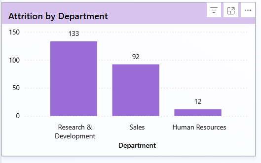
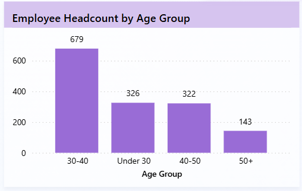
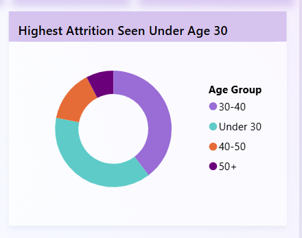
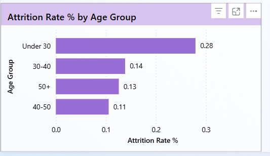
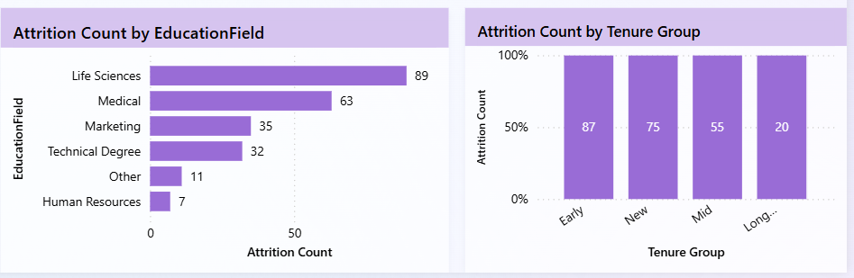

# Employee Attrition & Workforce Analytics Dashboard

This project analyzes employee attrition patterns using a workforce dataset of 1,470 employees.  
The dashboard was built in Power BI to understand attrition trends across departments, age groups, education fields, and tenure.

## Project Overview

The goal of this analysis is to identify workforce segments with higher attrition and highlight patterns that could help HR teams improve employee retention.

Dataset size: 1,470 employees

## Key Metrics

- Total Employees: 1,470  
- Active Employees: 1,233  
- Attrition Count: 237  
- Attrition Rate: 16%

## Dashboard Preview

## Attrition Analysis

### Attrition by Department

### Employee Headcount by Age Group

### Highest Attrition Under Age 30

## Attrition Breakdown

### Attrition Rate by Age Group

### Attrition by Education & Tenure

## Key Insights

- Employees under **30 years** show the highest attrition rate (~28%)
- **Research & Development** department has the highest attrition count
- Early-career employees contribute significantly to overall attrition
- Attrition varies across **education fields and tenure groups**

## Tools Used

- Power BI  
- Data Visualization  
- DAX Measures  
- Data Cleaning  

## Dataset

HR workforce dataset containing employee demographics, department, tenure, education field, and attrition status.
